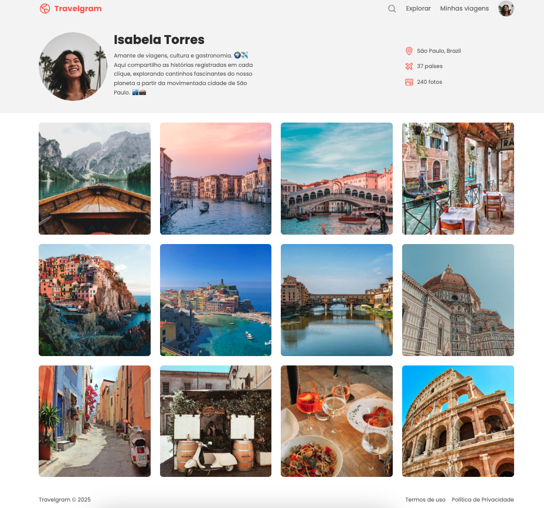

# 🌍 Travelgram - Rede Social de Viagens



**Travelgram** é um projeto fictício de uma rede social para apaixonados por viagens. Criado com foco em visual e usabilidade, o objetivo foi desenvolver uma interface inspiradora, onde usuários compartilham fotos, histórias e lugares incríveis ao redor do mundo.

---

## 🧰 Tecnologias utilizadas

- HTML5
- CSS3

---

## 💡 Objetivo do projeto

Este projeto foi desenvolvido para praticar habilidades de **HTML** e **CSS**, com foco em:

- Layout responsivo
- Organização visual de imagens em grade
- Estilização de perfis e conteúdo
- Uso de ícones e tipografia para melhorar a experiência do usuário

---

## 📸 Funcionalidades da interface

- Perfil de usuário com avatar, bio e localização
- Grade de fotos com destinos turísticos
- Estilo limpo e elegante, com cores suaves e foco na fotografia

---

## 📁 Como visualizar

Você pode baixar ou clonar este repositório e abrir o arquivo `index.html` no seu navegador:

```bash
git clone git@github.com:LucianaaFreitas/travelgram.git
cd travelgram


